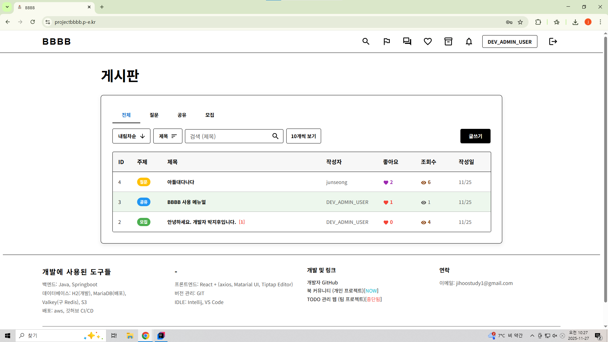
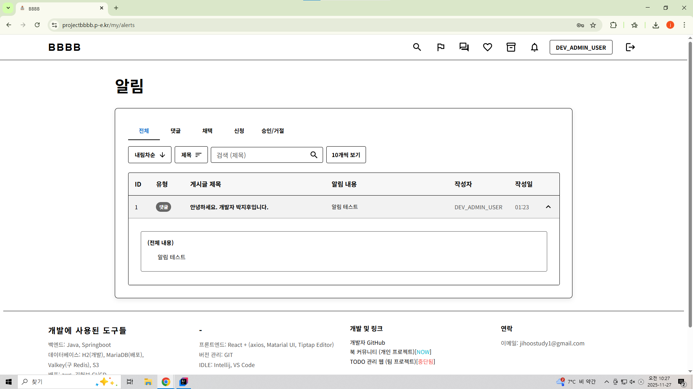
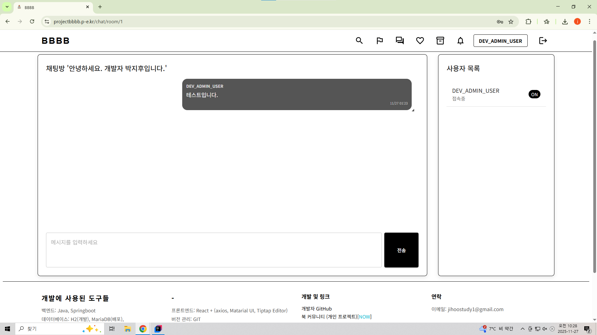
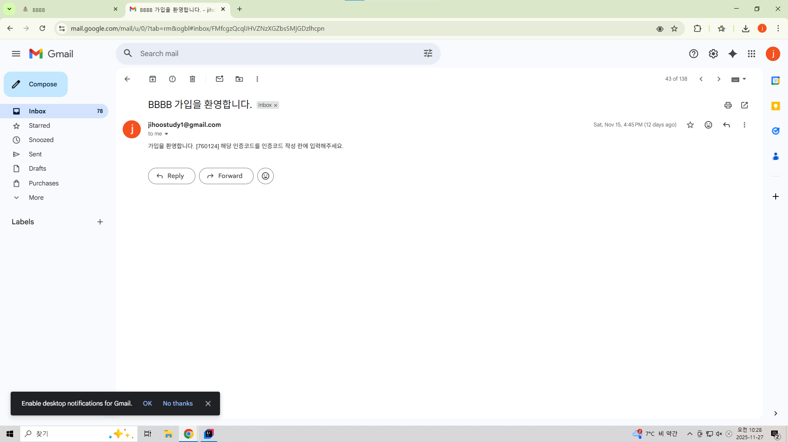
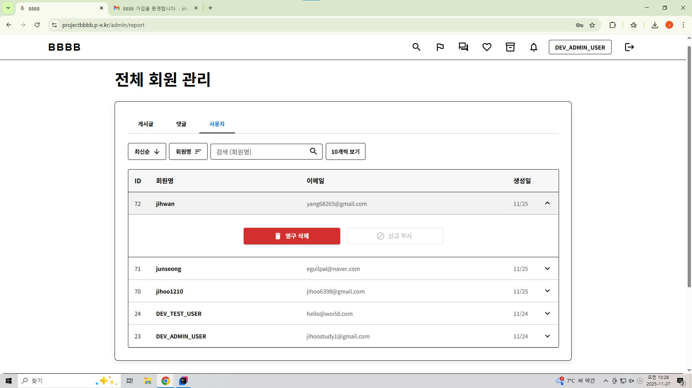
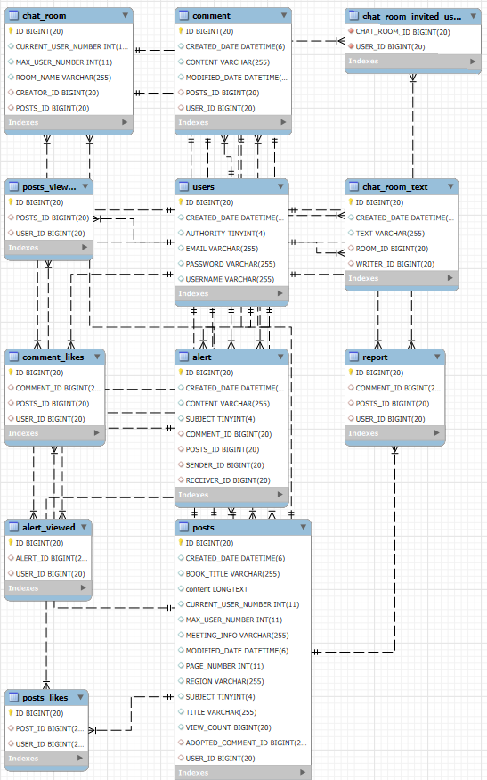

# Solo-Project-Book-Community - [바로가기](https://projectbbbb.p-e.kr)

## Index

- 결과 요약
- 프로젝트 개요
- 기술 스택
- 주요 기능
- 에러 슈팅
- 느낀점

## 1. 결과 요약

## 2. 프로젝트 개요

### A. 개발에 걸린 시간
- 25/11/7 ~ 25/11/26 (총 20일)

### B. 프로젝트 의도

- 독서가들 전용 __커뮤니티 웹__
- __게시글 CRUD 기능__
- __댓글 CRUD 기능__
- 초대된 사용자들과 __실시간 소통할 수 있는 채팅 기능__
- 회원 개인정보 보안을 위한 __이메일 인증 기능__

### C. 프로젝트 목표

- __Fullstack Web Service__ 개발 경험 확보
- 구조적 백엔드 설계 및 __안정적인 API 통신__
- React 기반 __SPA(Single Page Application) 구축__
- AWS 기반 __배포 및 운영 경험__

## 3. 기술 스택
### A. 백엔드

- `Java: 17`
- `Springboot 3.5.7`
#### A-1 기타 의존성
- Spring Data __JPA__
- Spring Data __Redis__
- Spring __Security__
- Spring __Validation__
- Spring __Web__
- Spring __Web Socket__
- Spring __Mail__
- __Lombok__
- __Json Web Token__
- __AWS S3 SDK__

### B. 프론트엔드

- `React 22`
#### B-1 기타 의존성

- __Axios__
- __Material UI__
- __React Router DOM__
- __Context API__
- __Tiptap Editor__
- __CSS Modules / Custom CSS__

### C. 배포 및 개발

- AWS __Elastic Beanstalk__
- AWS __EC2__
- AWS __S3__
- AWS __Cloud Front__
- AWS __Valkey__(구 Redis)
- AWS __IAM__
- mobaXterm __Linux__
- 도메인 사용: [내도메인.한국](https://xn--220b31d95hq8o.xn--3e0b707e/)
- Google Search Console

## 4. 주요 기능
### 관리자 계정:
- ID: jihoostudy1@gmail.com
- PASSWORD: password

> `페이지 정보 | 백엔드 API 주소` 로 표시되었습니다.
> 
> 해당 기능을 클릭하시면 해당하는 페이지로 이동됩니다.
>
> 로그인이 필요한 페이지는 _Italic_ 으로 표시되었습니다.
>
> API 응답 형식은 ResponseDto와 ResponseController를 참고하세요
>
> 참고: 데이터베이스 ERD
>
>

### A. 사용자 기능

#### [회원가입](https://projectbbbb.p-e.kr/auth/signup)
`POST /api/auth/signup`

- __절차__
  - 이메일 중복 및 이메일 유효성 검증
  - 회원명 중복 검사
  - 비밀번호 암호화
  - 데이터베이스에 회원 정보 등록

- __참고 컨트롤러__
  - 이메일 관련 컨트롤러
    - /backend/src/.../controller/AuthController
      - checkEmail(...): 이메일 전송 및 중복 검사 메서드
      - verifyCode(...): 이메일 코드 인증 메서드
    
 - 회원명 관련 컨트롤러
   - /backend/src/.../controller/AuthController
      - checkUsername(...): 회원명 중복 검사 메서드
    
- 비밀번호 암호화 및 데이터베이스 관련 컨트롤러
  - /backend/src/.../controller/AuthController
      - signup(...): 회원명 중복 검사 메서드

#### [로그인](https://projectbbbb.p-e.kr/auth/signin)
`POST /api/auth/signin`

- __<절차>__
  - AuthenticationManager를 통해서 데이터베이스에서 회원 정보 조회 및 인증
  - 인증이 되었을 경우 JWT 발급
  - 발급된 JWT를 이용해서 Cookie 생성
  - 회원명과 권한을 반환

- __<참고 코드>__
  - 로그인 관련 컨트롤러
    - /backend/src/.../controller/AuthController
      - signin(...): 로그인 메서드

  - JWT 관련 기능
    - /backend/src/.../security/TokenProvider
      - tokenProvide(...): 사용자(User 엔티티)를 이용해 토큰 생성하는 메서드

#### [비밀번호 재설정](https://projectbbbb.p-e.kr/auth/resetPassword)
`PATCH /api/temp/reset-password`

- __<절차>__
  - 이메일 인증 코드 인증 방식을 통해 회원 인증
  - 인증이 된 사용자는 ROLE_TEMP 권한을 가진 사용자로 Security Context에 등록
  - 입력된 비밀번호로 재설정

- __<참고 컨트롤러>__
  - 비밀번호 관련 컨트롤러
    - /backend/src/.../controller/TempController
      - resetPassword(...): 비밀번호 재설정 메서드

  - 이메일 관련 컨트롤러
    - /backend/src/.../controlelr/AuthController
      - sendCode(...): 이메일 코드 전송 메서드
    - /backend/src/.../controlelr/AuthController
      - verifyCodeAndGetUsername(...): 이메일 코드 인증 및 회원 정보 반환 메서드

#### [_회원 정보 조회 및 수정_](https://projectbbbb.p-e.kr/my/page)
`GET /api/user/my`
`PATCH /api/user/my/change-userInfo`

- __<절차>__
> \* 회원 정보 조회 *
  - 로그인된 사용자 정보를 @AuthenticationPrincipal를 이용해 조회
  - 필요한 정보를 반환

> \* 회원 정보 수정 *
  - 회원명을 변경할 경우 비밀번호를 빈 칸으로 제출
  - 비밀번호를 변경할 경우 회원명을 빈 칸으로 제출
  - 중복 검사된 회원명 또는 비밀번호를 변경

- __<참고 컨트롤러>__
  - 회원 정보 관련 컨트롤러
    - /backend/src/.../controlelr/UserController
      - myPage(...): 회원 정보 조회 메서드
      - changeUserInfo(...): 회원 정보 수정 메서드

 #### [_로그아웃_](https://projectbbbb.p-e.kr/)
`DELETE /api/auth/logout`

- __<절차>__
  - 해당 사용자의 식별자가 "ACCESS_TOKEN"인 쿠키의 maxAge를 0으로 설정하여 쿠키 삭제

- __<참고 컨트롤러>__
  - 관련 컨트롤러
    - /backend/src/.../controlelr/AuthController
      - logout(...): 로그아웃 메서드

#### [_회원 탈퇴_](https://projectbbbb.p-e.kr/my/page)
`DELETE /api/user/my/cancellation`

- __<절차>__
  - 로그인된 사용자 정보를 @AuthenticationPrincipal를 이용해 조회
  - 데이터베이스에서 조회된 사용자 삭제
  - 외래키 관리자가 User 엔티티가 아닌 정보는 직접 삭제
  - 프론트엔드에서 응답을 성공으로 확인하면 /api/auth/logout API 요청 및 로그인 화면으로 리다이렉트
  - 결과적으로 데이터베이스에서 사용자 삭제 & 쿠키(JWT) 삭제됨

- __<참고 컨트롤러>__
  - 회원 탈퇴 관련 컨트롤러
    - /backend/src/.../controlelr/UserController
      - cancellation(...): 회원 탈퇴 메서드

  - 로그아웃 관련 컨트롤러
    - /backend/src/.../controlelr/AuthController
      - logout(...): 로그아웃(JWT setMaxage(0)으로 쿠키 삭제) 메서드

### B. 게시글 CRUD 기능

#### [게시글 전체 조회](https://projectbbbb.p-e.kr/)
`GET /api/posts`

- __<절차>__
  - Pageable 정보와 세부 검색 조건을 받음
  - 세부 검색 조건을 통해서 Specification<?> 생성
  - Pageable과 Specification<?> 객체를 이용하여 findAll(...) 실행
  - 반환된 엔티티 정보를 Page<DTO>에 담아서 반환
  - 프론트엔드에서 현재 페이지 및 반환된 전체 객체 수 등을 참고하여 페이지 생성

- __<참고 코드>__
  - 게시글 조회 관련 컨트롤러
    - /backend/src/.../controlelr/PostsController
      - index(...): 게시글 전체 조회 메서드

  - 검색 조건 생성 및 조회 코드
    - /backend/src/.../service/searchSpec/PostsSearchSpec
      - search(...): 검색 조건 생성 메서드
    - /backend/src/.../repository/PostsRepository
      - extends JpaSpecificationExecutor<?>: Pageable과 Specification<?>으로 검색할 수 있는 메서드 제공

#### [_내 활동 게시글 조회_](https://projectbbbb.p-e.kr/my/actives)
`GET /api/posts/my`

- __<절차>__
  - @AuthenticationPrincipal를 이용하여 현재 사용자 조회
  - 매개변수에 현재 사용자를 추가하여 search(...) 호출
  - 이하 '전체 게시글 조회'와 동일...

- __<참고 코드>__
  - 내 활동 게시글 조회 관련 컨트롤러
    - /backend/src/.../controlelr/PostsController
      - indexByUser(...): 내 게시글 전체 조회 메서드

  - 이하 '전체 게시글 조회'와 동일...

#### [_즐겨찾기한 게시글 조회_](https://projectbbbb.p-e.kr/my/favorite)
`GET /api/posts/my/favorite`

- __<절차>__
  - Pageable 정보와 세부 검색 조건을 받음
  - @AuthenticationPrincipal를 이용하여 현재 사용자 조회
  - 세부 검색 조건을 통해서 Specification<?> 생성
  - Pageable과 Specification<?> 객체를 이용하여 findAll(...) 실행
  - 반환된 엔티티(PostsLikes) 정보에서 Posts 정보를 Page<DTO>에 담아서 반환

- __<참고 코드>__
  - 즐겨찾기한 게시글 조회 관련 컨트롤러
    - /backend/src/.../controlelr/PostsController
      - indexFavoriteByUser(...): 즐겨찾기한 게시글 조회 메서드

  - 검색 조건 생성 및 조회 코드
    - /backend/src/.../service/searchSpec/PostsLikesSpec
      - search(...): 검색 조건 생성 메서드
    - /backend/src/.../repository/PostsLikesRepository
      - extends JpaSpecificationExecutor<?>: Pageable과 Specification<?>으로 검색할 수 있는 메서드 제공

#### [_게시글 상세 조회_](https://projectbbbb.p-e.kr/post/2)
`GET /api/posts/{postsId}`

- __<절차>__
  - postsId를 통해 게시글 엔티티 조회
  - 조회된 게시글에서 댓글 엔티티 조회
  - 알림(신청, 승인, 거절) 여부 조회 -> [모집]
  - 채택 댓글 ID 조회 -> [질문]
  - PostsLikes에서 좋아요 여부 조회
  - 조회수 증가(열람한 게시글에 추가)
  - 조회된 모든 정보와 부가적으로 필요한 정보를 DTO에 담아 반환
  - 프론트엔드에서 현재 주제 및 상태에 따라서 정보 표시

> \* 내용에 img 태그가 존재할 경우

  -  img 태그의 data-key에서 key를 얻어 /api/files/url에 요청
  - S3 pre signed GET url 반환
  - 해당 img 태그의 src 속성에 해당 url 추가

- __<관련 코드>__
  - 게시글 상세 조회 관련 컨트롤러
    - /backend/src/.../controlelr/PostsController
      - show(...): 게시글 상세 조회 메서드

  - 상세 정보 관련 코드
    - /backend/src/.../repository/CommentRepository
      - findAllByPosts(...): 댓글 조회 메서드
    - /backend/src/.../repository/AlertRepository
      - findByPostsAndUserAndSenderAndSubject(...): 발신자와 수신자 그리고 상태로 알림 조회하는 메서드
      - findByPostsAndUserAndSubject(...): 수신자와 상태로 알림 조회하는 메서드

#### [_게시글 생성_](https://projectbbbb.p-e.kr/post/create)
`POST /api/posts`

- __<절차>__
  - 사용자로부터 받은 게시글 정보를 데이터베이스에 저장

> \* 사진 파일을 첨부할 경우
  - 사용자가 업로드한 사진의 정보를 /api/files/presign-upload에 전달
  - 백엔드에서 S3 pre signed upload url 및 key 반환
  - 반환된 Key 값을 data-key에 저장
  - upload url로 파일 저장
  - 미리보기를 위해 해당 key를 /api/files/url에 요청
  - S3 pre signed GET url 반환
  - 미리보기될 src 속성에 GET url 추가
  - 백엔드로 데이터 전달할 때 img 태그의 src 속성 제거 후 data-key를 저장
  - 제출할 때 현재 존재하는 data-key 값과 저장되었던 모든 data-key를 비교
  - 현재 존재하지 않는 key 값을 전부 DELETE /api/files에 전달하여 쓰레기 데이터 삭제

- __<관련 컨트롤러>__
  - 게시글 생성 관련 컨트롤러
    - /backend/src/.../controlelr/PostsController
      - create(...): 게시글 생성 메서드

  - S3 사진 관련 컨트롤러
    - /backend/src/.../controlelr/SFileController
      - presignUpload(...): S3에 업로드 및 Key 반환
      - getFileUrl(...): Key를 이용하여 S3를 조회할 수 있는 GET url 반환
      - deleteFile(...): Key를 이용하여 S3에서 데이터 제거

#### [_게시글 수정_(자신이 생성한 게시글만 수정할 수 있습니다.)](https://projectbbbb.p-e.kr/post/edit:id)
`PATCH /api/posts/{postsId}`

- __<절차>__
  - postsId로 수정할 게시글 조회
  - 사용자가 입력한 값이 있다면 게시글 정보 수정
  - modifiedDate 현재 시간으로 수정

> \* 사진 파일을 첨부할 경우
  - 이하 '게시글 생성'과 동일...

- __<참고 컨트롤러>__
  - 게시글 수정 관련 컨트롤러
    - /backend/src/.../controlelr/PostsController
      - update(...): 게시글 수정 메서드

  - S3 사진 관련 컨트롤러
    - /backend/src/.../controlelr/SFileController
      - presignUpload(...): S3에 업로드 및 Key 반환
      - getFileUrl(...): Key를 이용하여 S3를 조회할 수 있는 GET url 반환
      - deleteFile(...): Key를 이용하여 S3에서 데이터 제거

#### [_게시글 즐겨찾기 증감_](https://projectbbbb.p-e.kr/post/2)
`PATCH /api/posts/{postsId}/handle-likes`

- __<절차>__
  - postsId로 수정할 게시글 조회
  - @AuthenticationPrincipal를 이용하여 현재 사용자 조회
  - PostsLikes에 게시글과 현재 사용자로 조회하여 데이터가 있는지 확인
  - 데이터가 있다면 즐겨찾기 삭제 - PostsLikes에 삭제
  - 데이터가 없다면 즐겨찾기 추가 - PostsLieks에 추가
  - 현제 즐겨찾기됨 여부 반환

- __<참고 컨트롤러>__
  - 게시글 수정 관련 컨트롤러
    - /backend/src/.../controlelr/PostsController
      - handleLikes(...): 즐겨찾기 증감 메서드

#### [_게시글 삭제_(자신이 생성한 게시글만 삭제할 수 있습니다.)](https://projectbbbb.p-e.kr/post/2)
`DELETE /api/posts/{postsId}`

- __<절차>__
  - postsId로 삭제할 게시글 조회
  - 관리자이거나 작성자 인지 검사
  - 게시글 삭제
  - 세부 데이터들 자동 삭제됨 cascade, orphanRemoval

- __<참고 컨트롤러>__
  - 게시글 삭제 컨트롤러
    - /backend/src/.../controlelr/PostsController
      - delete(...): 게시글 삭제 메서드

### C. 댓글 CRUD 기능
**게시글 CRUD와 매우 유사하므로 생략하겠습니다.**

**알림 관련 기능은 전부 알림 색션에서 설명하도록 하겠습니다.**

### D. 알림 CRUD 기능
#### [_알림 전체 조회_](https://projectbbbb.p-e.kr/my/alerts)
`GET /api/alert/`

- __<절차>__
  - Pageable 정보와 세부 검색 조건을 받음
  - 현재 사용자 조회
  - 세부 검색 조건과 현재 사용자를 통해서 Specification<?> 생성
  - Pageable과 Specification<?> 객체를 이용하여 findAll(...) 실행
  - 반환된 엔티티 정보를 Page<DTO>에 담아서 반환
  - 프론트엔드에서 현재 페이지 및 반환된 전체 객체 수 등을 참고하여 페이지 생성

- __<참고 코드>__
  - 알림 전체 조회 컨트롤러
    - /backend/src/.../controlelr/AlertController
      - index(...): 알림 전체 조회 메서드

  - 검색 조건 생성 및 조회 관련 코드
    - /backend/src/.../service/searchSpec/AlertSearchSpec
      - search(...): Specification<?> 생서 메서드

#### [_읽지 않은 알림 여부 표시_](https://projectbbbb.p-e.kr/)
`GET /api/alert/check-new-alert`

- __<절차>__
  - 프론트엔드의 AlertContext는 페이지 location이 변경될 때마다 GET /api/alert/check-new-alert를 호출한다.
  - 백엔드는 AlertViewed와 Alert를 조회해서 보지 않은 알림이 있는지 확인한다.
  -. 읽지 않은 알림 여부를 boolean 값으로 반환한다.
  - 프론트엔드에서 반환받은 boolean 값을 통해 읽지 않은 알림이 있다면 붉은 색 badge로 표시한다.

- __<참고 코드>__
  - AlertContext
    - /frontend/src/utilites/AlertContext
      - ocation이 변경될 때마다 GET /api/alert/check-new-alert를 호출

  - 알림 전체 조회 컨트롤러
    - /backend/src/.../controlelr/AlertController
      - checkNewAlert(...): 읽지 않은 알림 여부 반환 메서드

- _알림 생성 및 전달 기능_

**기능이 많은 부분에 구현되어 있기 때문에 바로가기를 제공하지 않으며 기능 설명을 읽어주시기 바랍니다.**

- __<절차>__
  - 댓글의 경우 게시글 작성자에게 댓글 내용을 담은 알림이 전송된다.
  - 모임 신청의 경우 게시글 작성자에게 신청 내용을 담은 알림이 전송된다. 
  - 댓글 채택의 경우 댓글 작성자에게 채택 알림이 전송된다.
  - 모임 승인의 경우 이전의 신청 알림이 삭제되며 신청자에게 승인 알림이 전송된다.
  - 모임 거절의 경우 승인의 경우와 동일하다.

> * 전송이란?
  - 수신자 정보(user)에 알림을 받을 사람을 저장하여 데이터베이스에 저장한다는 의미이다.

- __<참고 컨트롤러>__
  - 댓글, 신청, 채택 알림 관련 컨트롤러
    - /backend/src/.../controlelr/CommentController
      - create(...): 댓글 알림 전송 메서드
      - applyRecruitment(...): 모임 신청 알림 전송 메서드
      - adoptComment(...): 댓글 채택 알림 전송 메서드
    
  - 모임 승인 및 거절 관련 컨트롤러
    - /backend/src/.../controlelr/RecruitAcceptController
      - accept(...): 신청 알림 삭제 및 승인 알림 전송 메서드
      - reject(...): 신청 알림 삭제 및 거절 알림 전송 메서드

### E. 커뮤니티 기능

**커뮤니티는 모집 게시판을 생성하거나 혹은 모임 신청이 승인되면 자동 생성 및 가입 됩니다.**

#### [커뮤니티 목록 확인](https://projectbbbb.p-e.kr/chat/list)
`GET /api/chatroom`

**'게시글 전체 조회'와 유사하므로 생략합니다.**

#### [_커뮤니티 접속 및 실시간 채팅_](https://projectbbbb.p-e.kr/chat/list)

**username, roomId 파라미터가 필요하므로 직접 접속하시길 바랍니다.**

- __<절차>__
> * 사용자 정보 로드
  - /api/chatroom/{roomId}로 요청을 보낸다.
  - 사용자 정보 및 채팅방 세부 정보를 반환한다.
  - 반환된 정보를 프론트엔드에서 표시한다.

> * 이전 25개의 대화 로드
  - /api/chatroom/text/{roomId}로 요청을 보낸다.
  - 응답 받은 25개의 이전 대화들을 반환한다.
  - 반환된 정보를 프론트엔드에서 표시한다.

> * 웹 소켓 접속
  - 초대된 사용자 또는 관리자인지 검사
  - 메모리로 관리되는 온라인 사용자 관리 Map에 접속한 회원, 접속한 roomId 저장

> * 웹 소켓에서 전체 채팅 전송
  - session을 통해서 roomId와 사용자를 찾아 데이터베이스에 저장한다.
  - 같은 roomId에 접속한 사용자들에게 채팅을 전송한다.

> * 웹 소켓 연결 끊음
  - 메모리로 관리되는 온리인 사용자 관리 Map에서 접속한 회원과 roomId를 제거한다.

- __<참고 코드>__
    - 웹 소켓 핸들러 관련 코드
      - /backend/src/.../socket/*
      - /backend/src/.../service/ChatRoomService
### F. 관리자 기능

**주요 기능 상단에 공유된 관리자 계정으로 접속해주세요.**

#### [_신고된 게시글 조회 및 삭제_](https://projectbbbb.p-e.kr/admin/report)
`GET /api/admin/posts`
`DELETE /api/admin/posts/{postsId}`
- __<절차>__
> * 신고된 게시글 조회
  - Pageable 정보와 세부 검색 조건을 받음
  - 세부 검색 조건을 통해서 Specification<?> 생성
  - Pageable과 Specification<?> 객체를 이용하여 findAll(...) 실행
  - 반환된 엔티티 정보를 Page<DTO>에 담아서 반환
  - 프론트엔드에서 현재 페이지 및 반환된 전체 객체 수 등을 참고하여 페이지 생성
> * 신고된 게시글 삭제
  - postsId로 삭제할 게시글 조회
  - 관리자이거나 작성자 인지 검사
  - 게시글 삭제
  - 세부 데이터들 자동 삭제됨 cascade, orphanRemoval
- __<참고 컨트롤러>__
    - 신고된 게시글 조회 및 삭제 관련 컨트롤러
        - /backend/src/.../controller/AdminController
          - indexPosts(...): 게시글 조회
          - deletePosts(...): 게시글 삭제

#### [_신고된 댓글 조회 및 삭제_](https://projectbbbb.p-e.kr/admin/report)
**'신고된 게시글 조회 및 삭제'와 유사하므로 생략하겠습니다.**

#### [_사용자 강제 삭제_](https://projectbbbb.p-e.kr/admin/report)
**'신고된 게시글 조회 및 삭제'와 유사하므로 생략하겠습니다.**

#### [_신고 무시_](https://projectbbbb.p-e.kr/admin/report)
`DELETE /api/admin/ignore/{objectType}/{reportId}`
- __<절차>__
    - objectType으로 무시할 신고의 타입(게시글, 댓글)을 확인한다.
    - reportId로 얻은 신고 엔티티에서 각 타입에 맞는 엔티티를 추출한다.
    - 해당 엔티티로 Report 테이블의 데이터를 조회하여 전부 삭제한다.
- __<참고 컨트롤러>__
    - 신고 무시 관련 컨트롤러
        - /backend/src/.../controller/AdminController
            - ignore(...): 신고 무시
## 5. 에러 슈팅

### A. 개발 중 발생한 에러
**나열한 에러 외에도 많은 오류가 있었지만 메모 해두었던 에러만 표시하겠습니다.**
- @NotBlank 사용 불가 오류
  - @NotBlank는 String 타입에만 사용할 수 있지만 Subject(enum)에 적용했기 때문에 발생한 오류
> 해결 방법: enum에도 적용할 수 있는 @NotNull 사용

- CLOB 타입 소문자 변환 오류
  -CLOB은 String이 아니기 때문에 .lower()을 사용할 수 없음
> 해결 방법: concat을 활용해 [내용] + ""을 통해 String으로 인식되게 만듦

- Post.getLikes() null 반환 오류
  - 생성자를 사용하지 않고 List<Likes\>에 접근할 때 @Builder 사용으로 인해 필드 선언 시의 초기화 구문이 무시됨
> 해결 방법: @Builder.default를 사용하여 초기화 구문 활성화

- Posts와 Comment의 무한 상호참조 오류
  -  Posts가 Comment를 참조하게 되면 Comment 또한 Posts를 참조하게 되기 때문에 무한 참조가 발생함
> 해결 방법: @JsonManagedReference(직렬화 시작점), @JsonBackReference(직렬화 종료점)를 통해 Comment에서 Posts를 참조할 때 종료점을 정한다.
>
> 해결 방법: List<Comment>가 아닌 Posts를 참조하지 않는 List<CommentDto\>를 통해 순환참조를 방지한다

- 회원 정보를 수정한 정보가 데이터베이스에 저장되지 않는 오류
  - @AuthenticationPrincipal로 가져온 CustomUserDetail에서 가져온 User 객체가 영속성 컨텍스트에 의해 관리되지 않음
> 해결 방법: 명시적으로 repository.save(user)를 호출하여 데이터베이스에 정보를 저장한다

- findAllByUser(User user, Specification<> spec, Pageable pageable) 오류
  - 원인: findAllByUser는 JPA에서 자동 생성할 수 없는 메서드임
> 해결 방법: User를 매게변수에서 제거하고 Specification을 반환하는 메서드에 매개변수로 user를 추가함

- url 파라미터를 dto로 받을 때 오류
  -url 파라미터를 @RequestParam을 이용해서 dto로 받았음
> 해결 방법: url 파라미터를 dto로 받을 때는 @RequestParam이 아닌 @ModelAttribute(생략 가능)을 사용해야 한다

- main yml > dev yml > local yml에서 dev yml > local yml 불러오는 중 오류 발생
  -스프링 부트 2.4+ 버전부터 프로파일 활성화는 main yml에서만 가능함
> 해결 방법: main yml에서 active: dev, local로 수정

- java.util.ConcurrentModificationException: null(컬렉션 순환중 수정 오류)
  - 영속 컬렉션(findAll()을 통해 가져온 객체들)을 순환하던 중(forEach() 사용)하며 외부 Iterator에서 동일한 리스트를 순환하며 수정(add/remove)했었음.
> 해결 방법: '스냅샷'을 생성한 후, 생성된 '복제 리스트'(스냅샷)을 순환하며 내부적으로 기존에 편집하려 했던 리스트를 수정한다.

### B. 배포 중 발생한 에러
#### B-1 CloudFront
- 백엔드 API가 정상적으로 실행되지 않던 오류
  -Origin 설정을 api/*로 구분하지 않고 /*로 통일해서 사용했음
> 해결 방법: 백엔드 API 접두사를 /api로 통일시킨 후 Origin 설정에서 api/*로 설정한다. \
>
> Http 메서드를 전부 허용하고 Origin Request 설정에서 "ACCESS_TOKEN"을 허용한다.

#### B-2 Elastic Beanstalk
- 인스턴스 상태가 50X Severe
  -healthcheck 메서드 없었음
  - ddl-auto: none 이지만 데이터베이스에 테이블 안 만들었음
  - Maria database 테이블 대소문자 구분
  -initial data 중복

> 해결 방법: healthcheck 메서드 생성, 데이터베이스 대소문자 구분해서 생성, initial data에 존재 검사 추가>
>
> 해결 방법: ps aux | grep java | grep -v grep: 실행중인 java 애플리케이션 정보 조회
>
> 해결 방법: journalctl _PID=[PID 번호] -f: 실행중인 프로그레스 로그 확인

## 느낀점

- 기초부터 제대로 설계하자.
1. 프로젝트 시작 전 ERD(Entity Relationship Diagram)와 API 명세를 충분히 작성하고 검증한다.
2. 테스트 코드를 통해 설계 단계에서 발생할 수 있는 오류를 조기에 발견한다.

- 완벽하다고 생각하지 말자.
1. 개발 단계에서 예외 상황 시뮬레이션을 진행해 예상치 못한 오류를 대비한다.
2. End-to-End 테스트를 통해 로컬 → 서버 → 배포 환경까지 전체 흐름을 검증한다.
3. 배포 전 체크리스트를 만들어 API prefix, healthcheck, DB 대소문자 구분 등을 점검한다.
4. 운영 환경에서 발생할 수 있는 장애를 대비해 로그 모니터링 및 알림 시스템을 구축한다.

- AI를 최대한 잘 활용하자.
1. 오류 발생 시 AI를 활용해 원인 후보를 빠르게 탐색한다.
2. AI 답변을 공식 문서와 커뮤니티 자료와 교차 검증하여 신뢰성을 확보한다.
3. 반복되는 오류 패턴은 AI를 통해 자동화된 해결 가이드를 만들어 재사용한다.
4. AI를 단순 검색 도구가 아닌 설계 검토 및 코드 리뷰 보조 도구로 활용한다.

- 웹 서치도 분명 필요하다.
1. AWS, Spring Boot, JPA 등 버전별 차이가 큰 기술은 반드시 공식 문서를 확인한다.
2. 최신 사례와 운영 경험은 블로그, GitHub Issues, StackOverflow 등을 통해 보완한다.
3. AI 검색과 웹 검색을 병행하여 빠른 문제 파악과 깊이 있는 해결책을 동시에 확보한다.
4. 검색한 자료는 프로젝트 문서에 기록해 지식 베이스로 축적한다.
